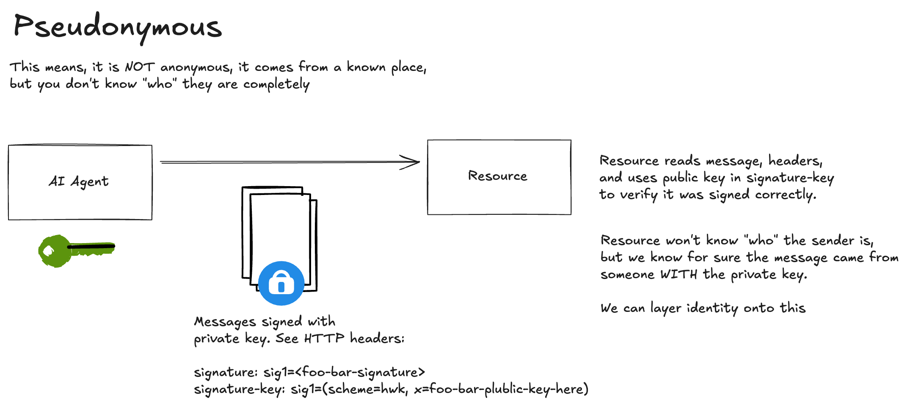

# Phase 1 Implementation: Pseudonymous Flow




## Status: ✅ Complete

Phase 1 implements basic proof-of-possession without identity using `sig=hwk` scheme.


## How It Works

1. **Agent generates ephemeral key pair** (Ed25519)
2. **Agent signs request** with `sig=hwk`:
   - Public key included in `Signature-Key` header
   - Signature covers `@method`, `@target-uri`, and `content-digest` (if body exists)
3. **Resource validates signature**:
   - Extracts public key from `Signature-Key` header
   - Reconstructs signature base
   - Verifies signature using Ed25519
4. **Resource grants access** if signature is valid

## Running Phase 1

### Run Tests
```bash
pytest tests/test_phase1.py -v
```

### Run Demo
```bash
python demo_phase1.py
```

### Run Participants Manually

**Terminal 1 - Resource (with debug):**
```bash
# Basic debug (signature verification details)
AAUTH_DEBUG=1 python -m participants.resource

# HTTP-level debug (shows full request/response headers and bodies, curl-like)
AAUTH_DEBUG_HTTP=1 python -m participants.resource

# Both debug levels
AAUTH_DEBUG=1 AAUTH_DEBUG_HTTP=1 python -m participants.resource
```

**Terminal 2 - Agent (interactive):**
```python
import os
# Enable HTTP-level debug to see full request/response (curl-like)
os.environ["AAUTH_DEBUG_HTTP"] = "1"
# Or enable signature verification debug
# os.environ["AAUTH_DEBUG"] = "1"

from participants.agent import Agent
import asyncio

agent = Agent("https://agent.example")
async def test():
    response = await agent.request_resource("http://localhost:8002/data")
    print(f"Status: {response.status_code}")
    if response.status_code == 200:
        print(f"Response: {response.json()}")
    else:
        print(f"Error: {response.text}")

asyncio.run(test())
```

**Note:** When `AAUTH_DEBUG_HTTP=1` is set, you'll see:
- **Agent side**: Full HTTP request headers and body (what the agent sends)
- **Agent side**: Full HTTP response headers and body (what the agent receives)
- **Resource side**: Full HTTP request headers and body (what the resource receives)
- **Resource side**: Full HTTP response headers and body (what the resource sends)

This gives you curl-like visibility into the HTTP traffic between agent and resource.

## Key Features

- ✅ Ed25519 cryptographic signatures
- ✅ RFC 9421 HTTP Message Signing
- ✅ Content-Digest for body integrity
- ✅ GET and POST request support
- ✅ Proper error handling (401 for invalid signatures)
- ✅ Label consistency checking (Signature-Input, Signature, Signature-Key must use same label)
- ✅ Timestamp validation (60-second tolerance)


## Notes

- Phase 1 uses `sig=hwk` (pseudonymous) - no identity, just proof-of-possession
- Keys are ephemeral (generated at startup)
- No tokens yet (that comes in Phase 3)
- Simple in-memory implementation (no persistence)

## What Was Implemented

### Core Components

1. **`core/crypto_utils.py`**
   - Ed25519 key pair generation
   - JWK conversion (private/public key ↔ JWK format)
   - JWKS document generation
   - Key utilities for Phase 2+ preparation

2. **`core/httpsig.py`**
   - HTTP Message Signing (RFC 9421) implementation
   - Signature generation with `sig=hwk` scheme (using label `sig1`)
   - Signature verification with label consistency checking
   - Signature-Key header parsing (supports any label: sig, sig1, etc.)
   - Support for `@method`, `@authority`, `@path`, `@query`, `content-type`, `content-digest`, and `signature-key` components
   - RFC 9530 Content-Digest support
   - Timestamp validation (60-second tolerance)

### Participants

3. **`participants/agent.py`**
   - Agent that signs requests with `sig=hwk`
   - FastAPI server (for future metadata endpoints)
   - `request_resource()` method for making signed requests

4. **`participants/resource.py`**
   - Resource server that validates signatures
   - Protected `/data` endpoint (GET and POST)
   - Signature verification logic
   - Returns 401 for unsigned/invalid requests

### Testing

5. **`tests/test_phase1.py`**
   - Test for successful signed request
   - Test for rejected unsigned request
   - Test for POST request with body

6. **`demo_phase1.py`**
   - Interactive demo script
   - Shows all Phase 1 functionality