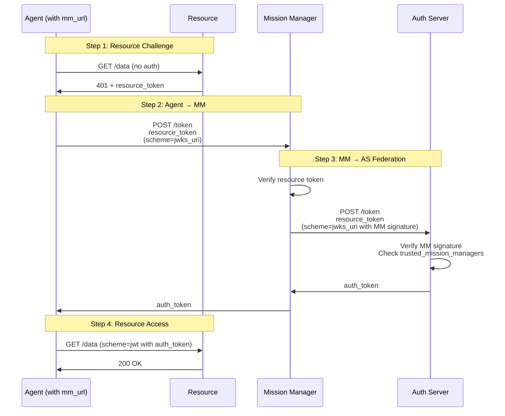

# Phase 11: MM-AS Trust (Federated Token Path)

Phase 11 demonstrates the **federated token path via Mission Manager**. When an agent is configured with a `mm_url`, all authorization token requests flow through the Mission Manager instead of going directly to the Auth Server.

## Overview

### Standard Flow (No MM)

1. Agent → Resource (receives resource token)
2. Agent → Auth Server directly (receives auth token)
3. Agent → Resource (with auth token)

### Federated Flow (With MM)

1. Agent → Resource (receives resource token)
2. Agent → **Mission Manager** (sends resource token)
3. Mission Manager → Auth Server (federates with HTTP signature)
4. Auth Server validates MM trust and issues auth token
5. Mission Manager → Agent (returns auth token)
6. Agent → Resource (with auth token)

## Architecture Flow



## Key Features

### Mission Manager Configuration

- **Agent Configuration**: `mm_url` points to Mission Manager
- **Token Endpoint Override**: Agent uses MM's `token_endpoint` instead of AS
- **Transparent to Agent**: Agent code remains the same

### Auth Server Trust

- **Trusted Mission Managers**: AS maintains list of trusted MMs
- **MM Signature Verification**: AS verifies MM's HTTP signature
- **Trust Delegation**: AS trusts MM's validation of agent and resource token

### Audit Trail Benefits

- **Centralized Control**: All agent authorizations flow through MM
- **Enhanced Logging**: MM logs all token requests
- **Policy Enforcement**: MM can apply organization-wide policies
- **Federated Identity**: MM acts as intermediary for agent identity

## What Was Implemented

### Core Components

- **`participants/mission_manager.py`**
  - `POST /token` endpoint for agent token requests
  - Resource token validation
  - Federation with Auth Server using HTTP signature
  - Mission Manager metadata endpoint

- **`participants/auth_server.py`**
  - `trusted_mission_managers` configuration
  - MM signature verification
  - Trust validation for federated requests

- **`participants/agent.py`**
  - `mm_url` configuration option
  - Automatic routing to MM's token endpoint
  - Metadata discovery for MM endpoints

### Demo Script

- **`demo_phase11.py`**
  - **TEST 1**: Agent WITH `mm_url` (federated flow)
  - **TEST 2**: Agent WITHOUT `mm_url` (direct AS flow)
  - Shows contrast between federated and direct paths

## Testing

```bash
python demo_phase11.py
pytest tests/test_phase11.py -v
```

## Comparison: Direct vs Federated

| Aspect | Direct (No MM) | Federated (With MM) |
|--------|----------------|---------------------|
| **Agent Config** | No `mm_url` | Has `mm_url` |
| **Token Request Path** | Agent → AS | Agent → MM → AS |
| **Signature** | Agent signs to AS | Agent signs to MM, MM signs to AS |
| **Trust Model** | AS trusts agent directly | AS trusts MM, MM validates agent |
| **Audit Trail** | AS logs only | MM logs + AS logs |
| **Policy Enforcement** | AS only | MM + AS |

## Notes

- Both paths result in valid auth tokens
- Federated path provides better centralized control
- Mission Manager acts as authorization intermediary
- Auth Server must explicitly trust the Mission Manager
- Agent code doesn't need to change based on configuration
