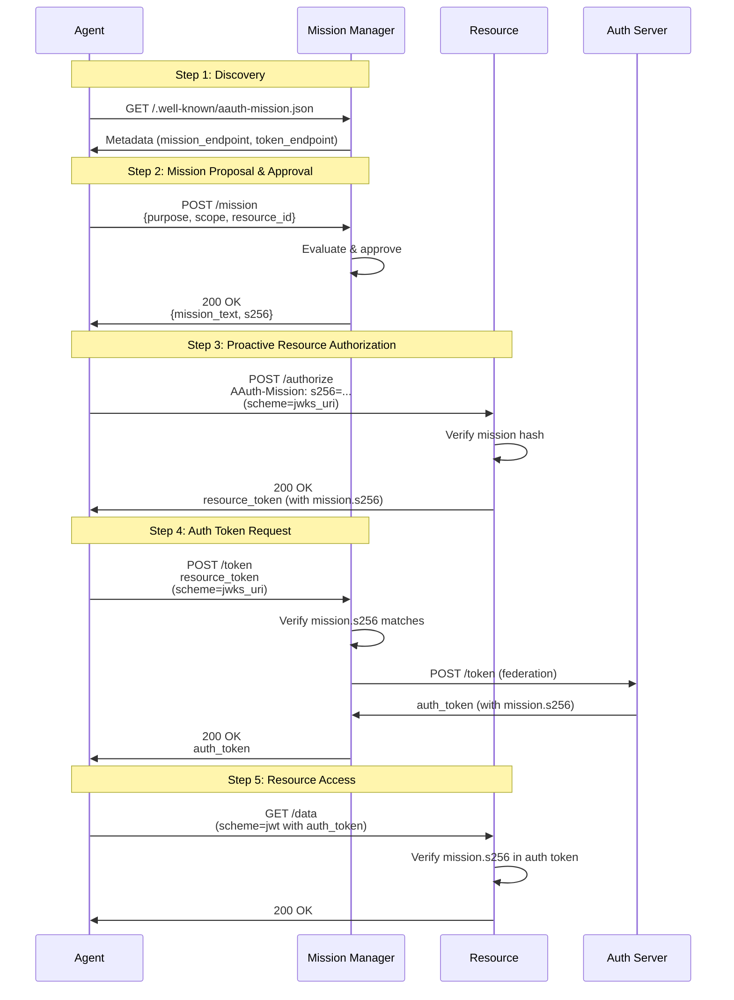

# Phase 12: Mission Lifecycle

Phase 12 demonstrates the **complete mission lifecycle** from proposal through approval, token acquisition, and resource access. This phase shows how mission hashes (`s256`) are preserved across the entire token chain.

## Overview

The complete mission lifecycle includes:

1. **Discovery**: Agent discovers MM metadata to locate mission endpoint
2. **Proposal**: Agent proposes a mission to the Mission Manager
3. **Approval**: Mission Manager approves and returns mission text + hash
4. **Resource Token**: Agent proactively obtains resource token with mission
5. **Auth Token**: Agent requests auth token from MM (with mission)
6. **Resource Access**: Agent accesses resource with auth token (with mission)
7. **Hash Verification**: Mission hash is verified at every step

## Architecture Flow



## Key Features

### Mission Lifecycle Stages

1. **Discovery**: `GET /.well-known/aauth-mission.json`
   - Find `mission_endpoint` for proposals
   - Find `token_endpoint` for auth requests

2. **Proposal**: `POST {mission_endpoint}`
   - Agent describes intended access
   - Includes purpose, scope, resource identifier

3. **Approval**: Mission Manager response
   - Returns mission text
   - Returns `s256` hash for verification

4. **Resource Token**: `POST /authorize` with `AAuth-Mission`
   - Proactive authorization
   - Resource token includes `mission.s256` claim

5. **Auth Token**: `POST /token` via MM
   - MM federates with AS
   - Auth token includes `mission.s256` claim

6. **Resource Access**: Protected endpoint
   - Validates `mission.s256` in auth token
   - Grants access if valid

### Mission Hash Verification

The `s256` hash is verified at each step:

- **Mission Manager**: Generates hash from approved mission text
- **Resource**: Includes hash from `AAuth-Mission` header in resource token
- **Auth Server**: Preserves hash in auth token
- **Resource Access**: Validates hash in auth token matches original

## Token Chain

```
Mission Text
    ↓ (SHA-256)
s256 Hash
    ↓ (AAuth-Mission header)
Resource Token {mission: {s256: "..."}}
    ↓ (POST /token)
Auth Token {mission: {s256: "..."}}
    ↓ (scheme=jwt)
Resource validates mission.s256
```

## What Was Implemented

### Core Components

- **`participants/mission_manager.py`**
  - Metadata endpoint: `/.well-known/aauth-mission.json`
  - Mission endpoint: `POST /mission`
  - Mission approval logic
  - Hash generation and storage

- **`participants/resource.py`**
  - Authorization endpoint: `POST /authorize`
  - `AAuth-Mission` header parsing
  - Mission claim in resource tokens

- **`participants/auth_server.py`**
  - Mission claim propagation
  - Mission validation in auth tokens

- **`participants/agent.py`**
  - Metadata discovery
  - Mission proposal helpers
  - Mission-aware authorization flow

### Demo Script

- **`demo_phase12.py`**
  - Full end-to-end mission lifecycle
  - Hash verification at each step
  - Shows complete token chain with mission

## Testing

```bash
python demo_phase12.py
pytest tests/test_phase12.py -v
```

## Hash Verification Points

The demo verifies `mission.s256` hash at:

1. ✓ Mission approval response
2. ✓ Resource token claims
3. ✓ Auth token claims
4. ✓ Resource access validation

All must match the original hash from step 2 (approval).

## Notes

- Mission hash provides end-to-end verification of authorization intent
- Mission text is human-readable description of access purpose
- Hash prevents tampering with mission during token flow
- Resources can audit mission context for access decisions
- Mission approval can be automated or require human review
