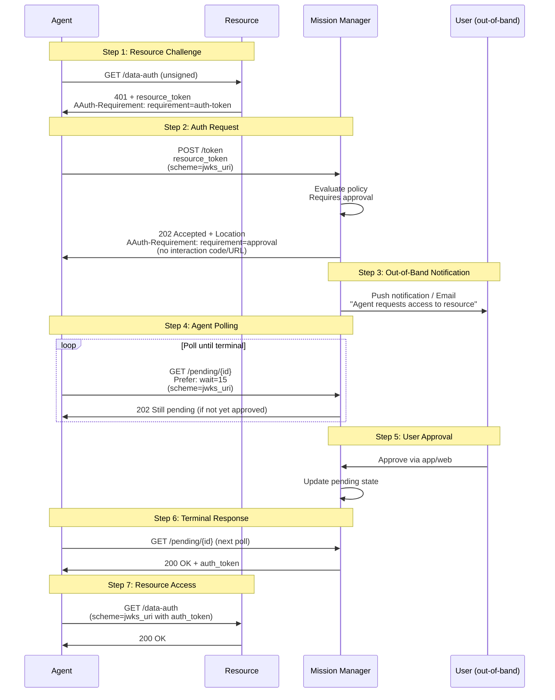

# Phase 13: Direct Approval

Phase 13 demonstrates **Direct Approval** flow per SPEC_UPDATED.md Section 4.5.6. Instead of redirecting the agent to an interaction URL, the Mission Manager contacts the user via an out-of-band channel (push notification, email, existing session) and the agent simply polls for approval.

## Overview

In the standard interaction flow, agents receive `require=interaction` with an interaction URL/code for user redirect. In the direct approval flow:

1. Agent requests authorization and receives `require=approval` (no interaction URL)
2. Mission Manager contacts user via out-of-band channel
3. Agent polls the pending URL waiting for approval
4. User approves/denies via out-of-band channel
5. Agent's next poll receives terminal status (200 with token or 403 denied)

## Architecture Flow



## Key Features

### Direct Approval Flow

- **No Interaction URL**: Agent doesn't redirect user anywhere
- **Out-of-Band Notification**: MM uses push/email/existing session
- **Polling Only**: Agent polls pending URL waiting for decision
- **Terminal States**: 200 (approved + token) or 403 (denied)

### AAuth-Requirement Header

```
AAuth-Requirement: requirement=approval
```

Key differences from interaction flow:

| Aspect | Interaction Flow | Direct Approval Flow |
|--------|------------------|----------------------|
| **Requirement** | `requirement=interaction` | `requirement=approval` |
| **Interaction Code** | Included | None |
| **Interaction URL** | Available | None |
| **Agent Action** | Redirect user to URL | Poll pending URL only |
| **User Action** | Browser interaction | App/email/existing session |

### Polling Behavior

- **Prefer Header**: `Prefer: wait=15` for long polling
- **Pending Responses**: 202 until approval/denial
- **Terminal Response**: 200 (approved) or 403 (denied)
- **Token Delivery**: Included in 200 response body

## What Was Implemented

### Core Components

- **`participants/mission_manager.py`**
  - Direct approval mode for specific policies
  - Out-of-band notification simulation
  - Pending state management (approval/denial)
  - Long polling support with `Prefer: wait=N`

- **`participants/agent.py`**
  - Handling `require=approval` responses
  - Polling loop for pending approval
  - No interaction redirect for approval flow

- **`aauth/agent/poller.py`**
  - Generic pending URL polling
  - `Prefer: wait=N` header support
  - Terminal state detection

### Demo Script

- **`demo_phase13.py`**
  - **TEST 1**: Happy path - auto-approval after delay
  - **TEST 2**: Denial path - auto-denial after delay
  - Simulates out-of-band approval with background tasks

## Testing

```bash
python demo_phase13.py
pytest tests/test_phase13.py -v
```

## Use Cases

Direct approval is useful when:

- User is already authenticated in a mobile app
- System can send push notifications
- Email-based approval workflows
- User has an existing admin console session
- Agent has no UI capability for browser redirect

## Flow Comparison

### Standard Interaction Flow
1. 202 + interaction code
2. Agent redirects user to `/interact?code=...`
3. User completes browser flow
4. Agent polls pending URL
5. Terminal response

### Direct Approval Flow
1. 202 (no interaction code)
2. MM sends push notification/email
3. User approves in app/email
4. Agent polls pending URL
5. Terminal response

## Notes

- Direct approval requires reliable out-of-band communication channel
- Agents must be prepared to poll for extended periods
- Mission Manager can apply timeout policies
- Both approval and denial are terminal states
- Polling uses signed requests for security
