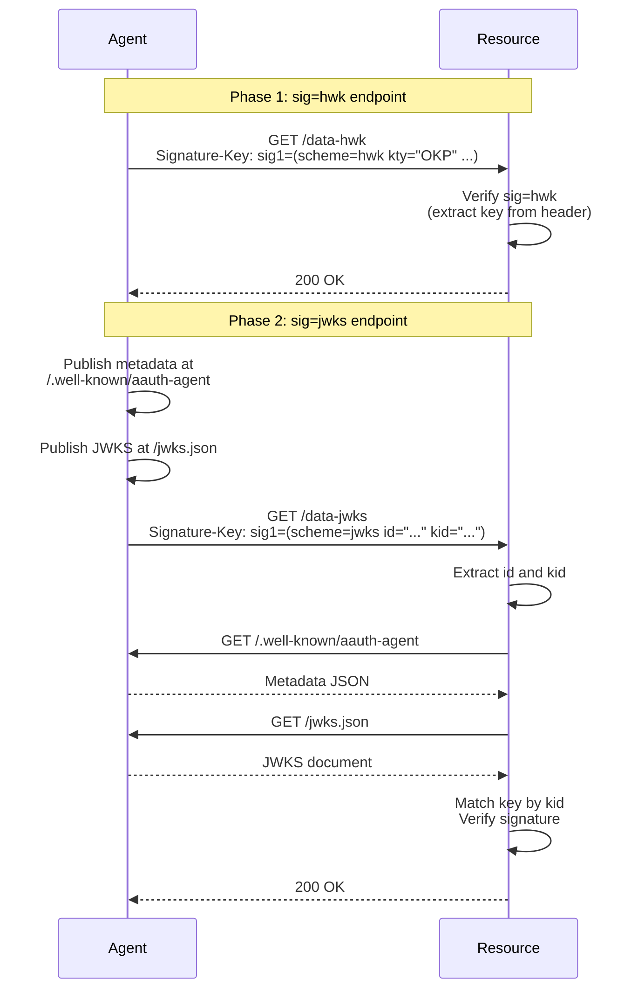

# Phase 2: Agent Identity via JWKS

## Status: Complete ✅

Phase 2 adds agent identity verification using JWKS discovery while maintaining full backward compatibility with Phase 1's `sig=hwk` scheme. The resource exposes **separate endpoints for each signature scheme** (`/data-hwk`, `/data-jwks`) to enable clear demonstration of both capabilities simultaneously.

## What Was Implemented

### Core Components

1. **Metadata Module** (`core/metadata.py`)
   - `generate_agent_metadata()` - Generates agent metadata JSON per AAuth spec Section 8.1
   - `fetch_metadata()` - Fetches metadata documents via HTTPS

2. **Agent Updates** (`participants/agent.py`)
   - Added `/.well-known/aauth-agent` metadata endpoint
   - Updated `/jwks.json` endpoint to include `kid` in keys
   - Made signing scheme configurable (`sig_scheme` parameter)
   - Added `sig_scheme` parameter to `sign_request()` and `request_resource()` methods
   - Defaults to `sig=hwk` for backward compatibility

3. **Resource Updates** (`participants/resource.py`)
   - Added separate endpoints:
     - `/data-hwk` - Requires `sig=hwk` scheme (Phase 1)
     - `/data-jwks` - Requires `sig=jwks` scheme (Phase 2)
   - Kept `/data` endpoint for backward compatibility (defaults to `sig=hwk`)
   - Added scheme validation (rejects wrong scheme for endpoint)
   - Implemented `_fetch_jwks_for_agent()` using Mode 2 discovery (spec Section 10.7)
   - Added JWKS fetching with debug support

4. **HTTPSig Updates** (`core/httpsig.py`)
   - Updated `_verify_signature_manual()` to handle both `sig=hwk` and `sig=jwks`
   - Added debug output for JWKS fetching steps
   - Enhanced `verify_signature()` to support `jwks_fetcher` callback

## How It Works

### Architecture Flow



### Key Differences: sig=hwk vs sig=jwks

| Aspect | sig=hwk (Phase 1) | sig=jwks (Phase 2) |
|--------|-------------------|-------------------|
| **Identity** | Pseudonymous (key in header) | Identified (agent_id + kid) |
| **Key Source** | Embedded in Signature-Key header | Fetched via JWKS discovery |
| **Discovery** | None (self-contained) | Mode 2: metadata → JWKS |
| **Use Case** | One-off requests, privacy | Persistent identity, auditability |

### Mode 2 Discovery Flow

When a resource receives a request with `sig=jwks`:

1. **Extract identifiers**: Parse `id` and `kid` from `Signature-Key` header
2. **Fetch metadata**: GET `{agent_id}/.well-known/aauth-agent`
3. **Extract JWKS URI**: Read `jwks_uri` from metadata
4. **Fetch JWKS**: GET `{jwks_uri}`
5. **Match key**: Find key with matching `kid`
6. **Verify signature**: Use matched key to verify HTTP signature

## Running Phase 2

### Automated Tests

Run the Phase 2 test suite:

```bash
pytest tests/test_phase2.py -v
```

This includes:
- Metadata generation and fetching tests
- JWKS handling tests
- Signature generation/verification tests
- Scheme validation tests
- Integration tests for both endpoints
- Backward compatibility tests

### Demo Script

Run the Phase 2 demo:

```bash
python demo_phase2.py
```

The demo shows:
- `sig=hwk` flow on `/data-hwk`
- `sig=jwks` flow on `/data-jwks`
- Metadata endpoint verification
- JWKS endpoint verification
- Wrong scheme rejection
- Both endpoints working independently

### Manual Testing

**Important Note for `sig=jwks` Testing:**
For `sig=jwks` to work, the agent instance used for signing requests MUST be the same one serving the JWKS endpoint. Each `Agent()` instance generates its own key pair, so if you create a new instance, it will have a different key than the server, causing verification to fail.

**Option 1: Use the same agent instance (recommended for manual testing)**

**Terminal 1 - Resource Server:**
```bash
python -c "from participants.resource import Resource; Resource('https://resource.example.com', port=8002).run()"
```

**Terminal 2 - Agent Server and Client (same instance):**
```python
# Start server in background, then use same instance for requests
from participants.agent import Agent
import uvicorn
import threading
import asyncio

agent = Agent("http://127.0.0.1:8001", port=8001)

# Start server in background thread
server_thread = threading.Thread(
    target=lambda: uvicorn.run(agent.app, host="127.0.0.1", port=8001, log_level="info"),
    daemon=True
)
server_thread.start()

# Wait for server to start
import time
time.sleep(2)

# Now use the SAME agent instance for requests
async def test():
    response = await agent.request_resource(
        "http://127.0.0.1:8002/data-jwks",
        sig_scheme="jwks"
    )
    print(f"Status: {response.status_code}")
    if response.status_code == 200:
        print(f"Response: {response.json()}")

asyncio.run(test())
```

**Option 2: Run servers separately (for sig=hwk only, or use demo script for sig=jwks)**

**Terminal 1 - Resource Server:**
```bash
python -c "from participants.resource import Resource; Resource('https://resource.example.com', port=8002).run()"
```

**Terminal 2 - Agent Server:**
```bash
python -c "from participants.agent import Agent; Agent('http://127.0.0.1:8001', port=8001).run()"
```

**Note:** If you create a new `Agent()` instance in Terminal 3, it will have a different key pair and `sig=jwks` will fail. Use the demo script (`python demo_phase2.py`) for `sig=jwks` testing, or use Option 1 above.

#### 2. Test sig=hwk on /data-hwk

**Terminal 3 - Python REPL:**
```python
import asyncio
from participants.agent import Agent

async def test():
    agent = Agent("http://127.0.0.1:8001", port=8001)
    response = await agent.request_resource(
        "http://127.0.0.1:8002/data-hwk",
        sig_scheme="hwk"
    )
    print(f"Status: {response.status_code}")
    print(f"Response: {response.json()}")

asyncio.run(test())
```

Expected output:
```
Status: 200
Response: {'message': 'Access granted', 'data': 'This is protected data', 'scheme': 'hwk', 'method': 'GET'}
```

#### 3. Test sig=jwks on /data-jwks

**Important:** For `sig=jwks` to work, the agent instance used for signing MUST be the same one serving the JWKS endpoint. The key pair used for signing must match the public key published in JWKS.

**Terminal 3 - Python REPL (using the SAME agent instance):**
```python
import asyncio
from participants.agent import Agent

# Create agent instance (same one that's running the server)
agent = Agent("http://127.0.0.1:8001", port=8001)

async def test():
    # Use the SAME agent instance for requests
    response = await agent.request_resource(
        "http://127.0.0.1:8002/data-jwks",
        sig_scheme="jwks"
    )
    print(f"Status: {response.status_code}")
    if response.status_code == 200:
        print(f"Response: {response.json()}")
    else:
        print(f"Error: {response.text}")

asyncio.run(test())
```

**Note:** If you create a NEW `Agent()` instance, it will generate a different key pair, and verification will fail because the JWKS endpoint returns a different public key than the one used for signing.

Expected output:
```
Status: 200
Response: {'message': 'Access granted', 'data': 'This is protected data', 'scheme': 'jwks', 'method': 'GET', 'agent_id': 'http://127.0.0.1:8001'}
```

#### 4. Verify Metadata Endpoint

```bash
curl http://127.0.0.1:8001/.well-known/aauth-agent
```

Expected output:
```json
{
  "agent": "http://127.0.0.1:8001",
  "jwks_uri": "http://127.0.0.1:8001/jwks.json"
}
```

#### 5. Verify JWKS Endpoint

```bash
curl http://127.0.0.1:8001/jwks.json
```

Expected output:
```json
{
  "keys": [
    {
      "kty": "OKP",
      "crv": "Ed25519",
      "x": "...",
      "kid": "key-1"
    }
  ]
}
```

#### 6. Test Wrong Scheme Rejection

**Terminal 3 - Python REPL:**
```python
import asyncio
from participants.agent import Agent

async def test():
    agent = Agent("http://127.0.0.1:8001", port=8001)
    # Try sig=hwk on /data-jwks (should fail)
    response = await agent.request_resource(
        "http://127.0.0.1:8002/data-jwks",
        sig_scheme="hwk"  # Wrong scheme!
    )
    print(f"Status: {response.status_code}")
    print(f"Response: {response.text}")

asyncio.run(test())
```

Expected output:
```
Status: 401
Response: Invalid signature scheme: expected jwks, got hwk
```

## Debug Mode

### AAUTH_DEBUG

Enable detailed signature verification debug output:

```bash
AAUTH_DEBUG=1 python demo_phase2.py
```

This shows:
- Signature base construction
- Component parsing
- Timestamp validation
- Key extraction and matching
- JWKS fetching steps (for `sig=jwks`)
- Signature verification results

### AAUTH_DEBUG_HTTP

Enable HTTP-level request/response logging (curl-like format):

```bash
AAUTH_DEBUG_HTTP=1 python demo_phase2.py
```

This shows:
- Full HTTP request headers and bodies
- Full HTTP response headers and bodies
- Both for agent→resource requests
- Both for resource→agent metadata/JWKS fetches

### Combined Debug

Enable both debug modes:

```bash
AAUTH_DEBUG=1 AAUTH_DEBUG_HTTP=1 python demo_phase2.py
```

## Examples

### Example 1: sig=hwk Request

```python
from participants.agent import Agent
import asyncio

async def example():
    agent = Agent("http://127.0.0.1:8001", port=8001)
    
    response = await agent.request_resource(
        "http://127.0.0.1:8002/data-hwk",
        sig_scheme="hwk"
    )
    
    print(response.json())
    # {'message': 'Access granted', 'data': 'This is protected data', 'scheme': 'hwk', 'method': 'GET'}

asyncio.run(example())
```

### Example 2: sig=jwks Request

```python
from participants.agent import Agent
import asyncio

async def example():
    agent = Agent("http://127.0.0.1:8001", port=8001)
    
    response = await agent.request_resource(
        "http://127.0.0.1:8002/data-jwks",
        sig_scheme="jwks"
    )
    
    print(response.json())
    # {'message': 'Access granted', 'data': 'This is protected data', 'scheme': 'jwks', 'method': 'GET', 'agent_id': 'http://127.0.0.1:8001'}

asyncio.run(example())
```

### Example 3: Both Schemes Side-by-Side

```python
from participants.agent import Agent
import asyncio

async def example():
    agent = Agent("http://127.0.0.1:8001", port=8001)
    
    # Test both endpoints
    response_hwk = await agent.request_resource(
        "http://127.0.0.1:8002/data-hwk",
        sig_scheme="hwk"
    )
    
    response_jwks = await agent.request_resource(
        "http://127.0.0.1:8002/data-jwks",
        sig_scheme="jwks"
    )
    
    print(f"sig=hwk: {response_hwk.json()['scheme']}")
    print(f"sig=jwks: {response_jwks.json()['scheme']}")

asyncio.run(example())
```

## Backward Compatibility

Phase 2 maintains full backward compatibility with Phase 1:

- ✅ Existing `/data` endpoint still works (defaults to `sig=hwk`)
- ✅ Phase 1 tests (`tests/test_phase1.py`) still pass
- ✅ `sig=hwk` scheme unchanged
- ✅ No breaking changes to API

## What's Next: Phase 3

Phase 3 will add **Autonomous Authorization** using tokens:
- Agent Tokens (issued by Agent Server to Agent Delegates)
- Resource Tokens (issued by Resource to Agent)
- Auth Tokens (issued by Auth Server to Agent)
- Token-based signature schemes (`sig=jwt`)

See `PLAN.md` for the full implementation plan.

