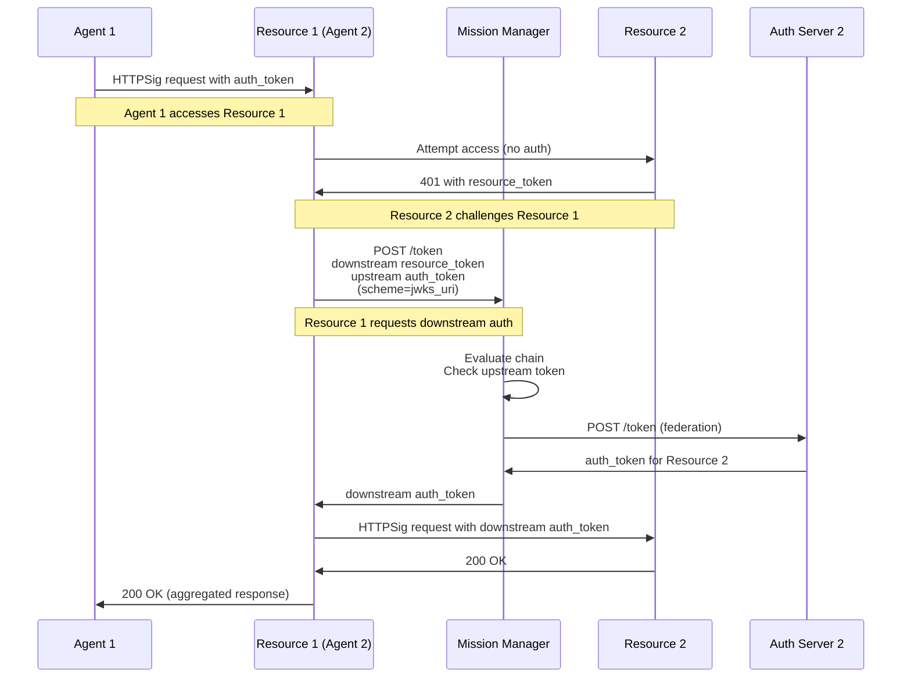

# Phase 7: Call Chaining

Phase 7 implements **Call Chaining** as described in SPEC_UPDATED.md Section "Call Chaining". This enables multi-hop resource access where Resource 1 (acting as an agent) can access Resource 2 by federating through its Mission Manager.

## Overview

When Resource 1 needs to call Resource 2 to fulfill a request:

1. Resource 1 receives the upstream auth token from Agent 1
2. Resource 1 attempts to access Resource 2 and receives a `401` with a resource token
3. Resource 1 sends the downstream resource token **plus** the upstream auth token to its Mission Manager
4. The Mission Manager evaluates the chain and federates with Resource 2's Auth Server
5. Resource 1 receives a downstream auth token from its MM
6. Resource 1 accesses Resource 2 with the downstream auth token
7. Resource 1 returns aggregated response to Agent 1

## Architecture Flow



## Key Features

### Call Chain Authorization

- **Upstream Context**: Resource 1 has auth token from Agent 1
- **Downstream Request**: Resource 1 needs to access Resource 2
- **Mission Manager Role**: Evaluates whether the chain is authorized
- **Federation**: MM federates with Resource 2's auth server

### Token Flow

1. **Upstream Auth Token**: From Agent 1 → Resource 1
2. **Downstream Resource Token**: From Resource 2 → Resource 1
3. **Chain Request**: Resource 1 → MM (both tokens)
4. **Downstream Auth Token**: MM → Resource 1 (for Resource 2)

## What Was Implemented

### Core Components

- **`participants/resource.py`**
  - Resources can act as agents for downstream calls
  - Chain authorization logic with upstream context
  - Integration with Mission Manager for downstream tokens

- **`participants/mission_manager.py`**
  - Chain evaluation logic
  - Federation with downstream auth servers
  - Upstream token validation

- **`flows/autonomous.py`**
  - Helper for chained resource access flows

### Demo Script

- **`demo_phase7.py`**
  - End-to-end call chaining demonstration
  - Agent 1 → Resource 1 → Resource 2 flow
  - Shows upstream and downstream token handling

## Testing

```bash
python demo_phase7.py
pytest tests/test_phase7.py -v
```

## Notes

- This replaces the old "Token Exchange" approach from the previous spec
- Call chaining uses Mission Manager federation instead of direct AS-to-AS trust
- The Mission Manager evaluates the entire chain context
- Resources need their own Mission Manager configuration to act as agents

## Differences from Old Token Exchange

| Aspect | Old Token Exchange | New Call Chaining |
|--------|-------------------|-------------------|
| **Authorization Path** | Resource → AS2 directly | Resource → MM → AS2 |
| **Trust Model** | AS-to-AS federation | MM federation |
| **Chain Context** | `act` claim | Upstream token evaluation |
| **Spec Section** | Old SPEC.md 3.9, 9.10 | SPEC_UPDATED.md Call Chaining |
