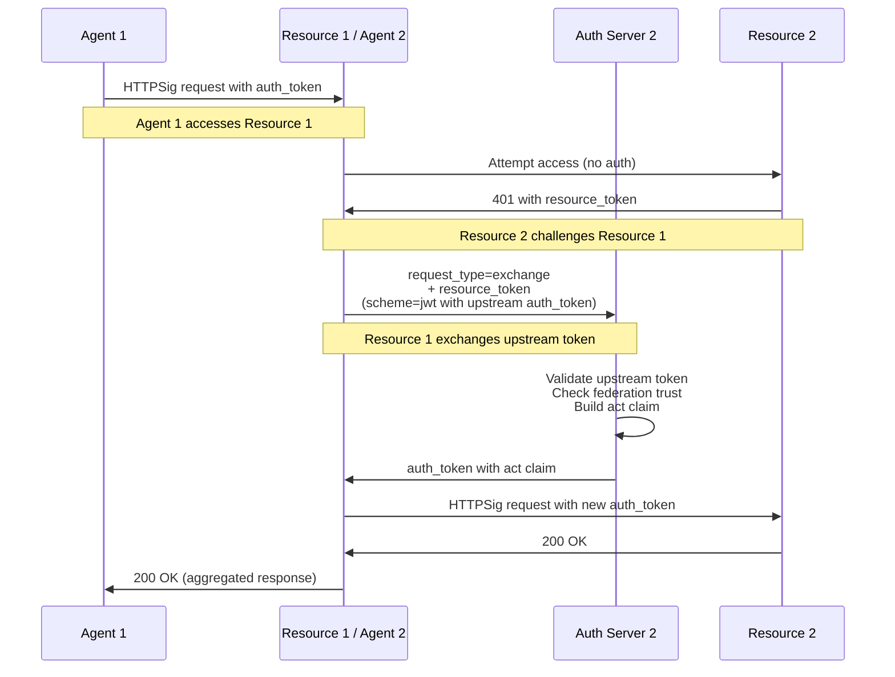

# Phase 7: Token Exchange

## Overview

Phase 7 implements **Token Exchange** as described in SPEC.md Section 3.9 and 9.10. This enables multi-hop resource access where a resource (acting as an agent) can exchange an upstream auth token to access a downstream resource.

When a resource needs to call a downstream resource to fulfill a request, it:
1. Presents the upstream auth token to the downstream auth server
2. Uses `request_type=exchange` to request a new token
3. Receives a new auth token with an `act` claim showing the delegation chain
4. Uses this new token to access the downstream resource

## Key Concepts

### Token Exchange Flow



### Federation Trust

Token exchange requires **federation trust** between auth servers:

- Auth Server 2 must trust Auth Server 1 to validate upstream tokens
- This is configured via the `trusted_auth_servers` parameter on `AuthServer`
- Without trust, the exchange request is rejected

```python
# Auth Server 2 trusts Auth Server 1
auth_server2 = AuthServer(
    "http://auth2.example",
    port=8005,
    trusted_auth_servers=["http://auth1.example"]
)
```

### Actor (`act`) Claim

The `act` claim represents the delegation chain. It shows who delegated authority to the current agent:

```json
{
  "iss": "https://auth2.example",
  "aud": "https://resource2.example",
  "agent": "https://resource1.example",
  "sub": "user-12345",
  "scope": "data.read",
  "act": {
    "agent": "https://agent1.example",
    "agent_delegate": "api-service-instance-abc",
    "sub": "user-12345"
  }
}
```

**Required fields in `act`:**
- `agent`: The HTTPS URL of the upstream agent

**Optional fields in `act`:**
- `agent_delegate`: The upstream agent delegate identifier
- `sub`: The user identifier (if present in upstream token)
- `act`: Nested actor claim for multi-hop chains (3+ levels)

### Multi-Hop Delegation Chains

For chains with more than two hops, the `act` claim can be nested:

```json
{
  "agent": "https://resource2.example",
  "act": {
    "agent": "https://resource1.example",
    "sub": "user-12345",
    "act": {
      "agent": "https://agent1.example",
      "sub": "user-12345"
    }
  }
}
```

## Implementation Details

### Files Modified

| File | Changes |
|------|---------|
| `core/tokens.py` | Added `act` parameter to `create_auth_token()` |
| `participants/auth_server.py` | Added `_handle_token_exchange()`, `trusted_auth_servers` config |
| `participants/resource.py` | Added `call_downstream_resource()` and `_exchange_token()` methods |

### Key Methods

#### `AuthServer._handle_token_exchange()`

Handles `request_type=exchange` requests:

1. Extracts `resource_token` from request body
2. Validates that `scheme=jwt` is used with upstream auth token
3. Parses and validates upstream token claims
4. Verifies upstream auth server is trusted
5. Fetches and validates upstream auth server JWKS
6. Validates upstream token signature
7. Validates resource token and extracts scope
8. Verifies upstream token audience matches requesting resource
9. Verifies HTTPSig signature using upstream token's `cnf.jwk`
10. Builds `act` claim from upstream token claims
11. Issues new auth token with `act` claim

#### `Resource.call_downstream_resource()`

Enables a resource to act as an agent:

1. Attempts to access downstream resource
2. Parses 401 challenge to extract `resource_token` and `auth_server`
3. Calls `_exchange_token()` to get downstream auth token
4. Signs request with exchanged token
5. Accesses downstream resource

#### `Resource._exchange_token()`

Performs the token exchange:

1. Builds POST request to auth server's token endpoint
2. Signs request with `scheme=jwt` using upstream auth token
3. Parses response to extract new auth token

## Running the Demo

```bash
# Run with debug output (default)
AAUTH_DEBUG=1 python demo_phase7.py

# Run with HTTP debug output
AAUTH_HTTP_DEBUG=1 python demo_phase7.py
```

The demo shows:
1. Agent 1 obtaining an auth token for Resource 1
2. Resource 1 calling Resource 2 via token exchange
3. Verification that the exchanged token contains the `act` claim

## Testing

```bash
# Run Phase 7 tests
pytest tests/test_phase7.py -v

# Run specific test
pytest tests/test_phase7.py::test_token_exchange_flow -v
pytest tests/test_phase7.py::test_token_exchange_returns_act_claim -v
pytest tests/test_phase7.py::test_untrusted_auth_server_rejected -v
```

### Test Coverage

| Test | Description |
|------|-------------|
| `test_create_auth_token_with_act_claim` | Auth token can include `act` claim |
| `test_create_auth_token_with_nested_act` | Nested `act` claims for multi-hop |
| `test_auth_server_with_trusted_servers` | Federation trust configuration |
| `test_token_exchange_flow` | Complete token exchange flow |
| `test_token_exchange_returns_act_claim` | Exchanged token has correct `act` claim |
| `test_untrusted_auth_server_rejected` | Exchange fails without trust |

## Security Considerations

### Federation Trust

- Auth servers MUST have explicit trust relationships configured
- Untrusted upstream tokens are rejected
- Trust relationships should be established through secure channels

### Scope Narrowing

Per SPEC.md, the downstream scope should typically be narrower than or equal to the upstream authorization. This implementation extracts the scope from the resource token.

### Chain Depth Limits

Auth servers MAY enforce limits on delegation chain depth to prevent abuse. The current implementation does not enforce limits but the `act` chain can be inspected for policy decisions.

### User Context Preservation

The `sub` claim MUST be maintained through the chain to preserve user identity. The implementation copies the user identifier from the upstream token to both the new token and the `act` claim.

### Refresh Tokens

Token exchange requests do not return refresh tokens. Resources must re-exchange when tokens expire.

## Reference

- [SPEC.md Section 3.9: Token Exchange](SPEC.md#39-token-exchange)
- [SPEC.md Section 9.10: Token Exchange](SPEC.md#910-token-exchange)
- [RFC 8693: OAuth 2.0 Token Exchange](https://www.rfc-editor.org/rfc/rfc8693) (conceptual background)

